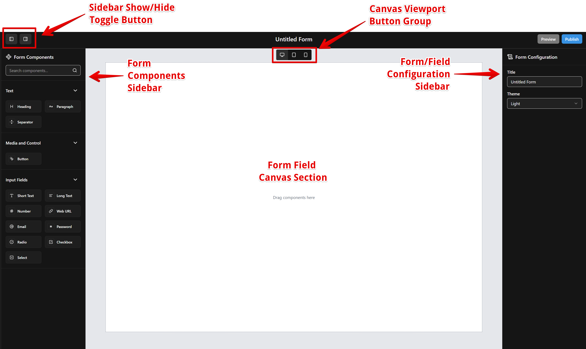
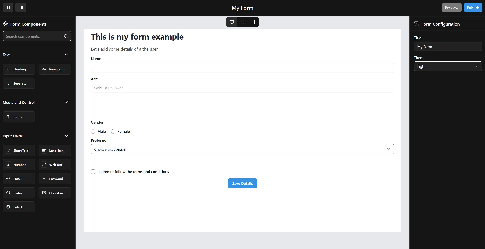
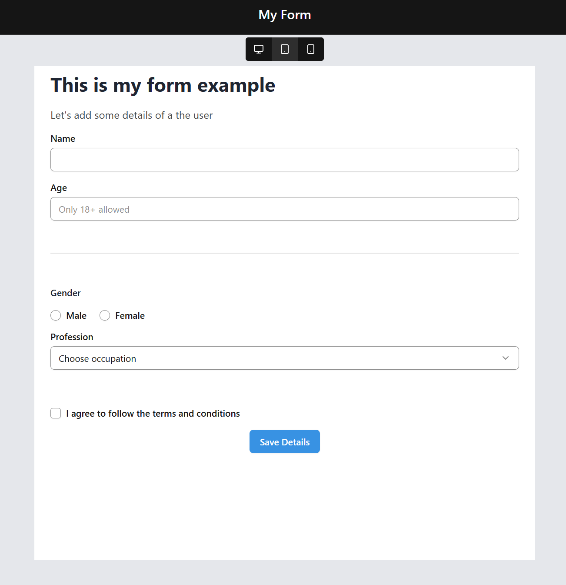
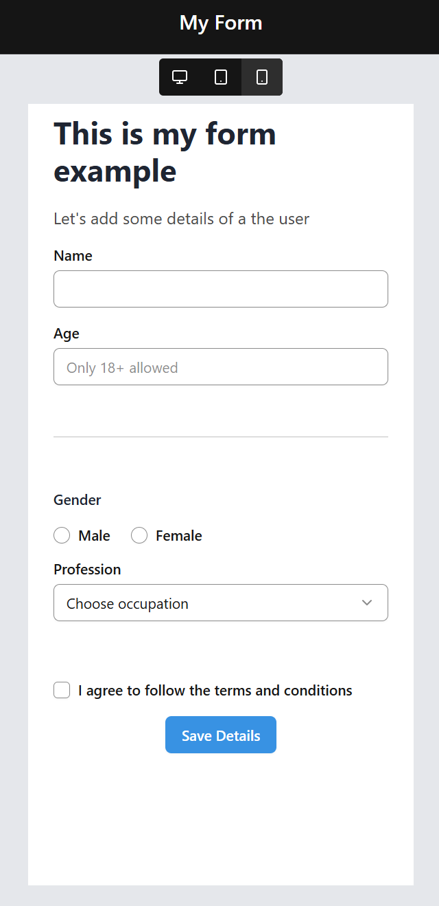
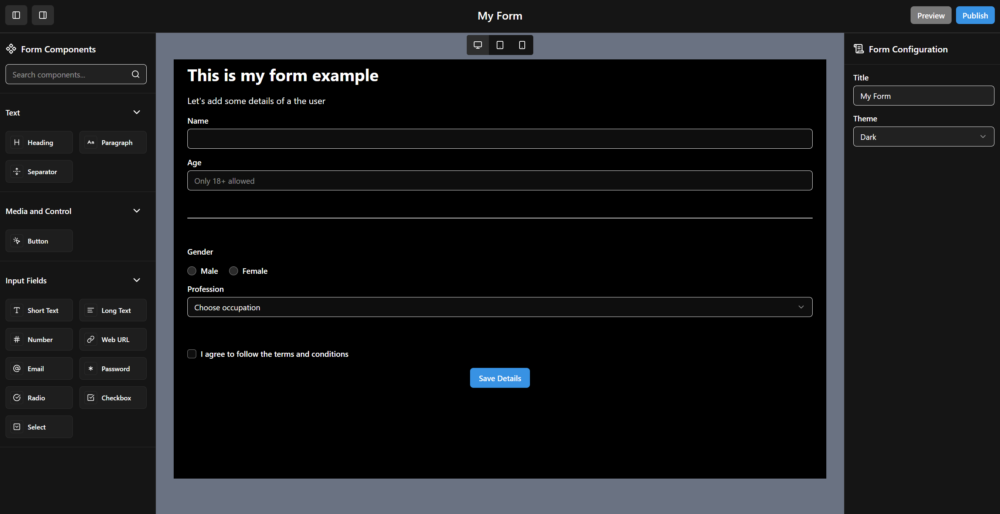

# Form Kit - A Visual DnD Form Editor
View Demo: [https://my-formkit-ui.netlify.app/builder](https://my-formkit-ui.netlify.app/builder)

## Overview
The application is crafted using `Next.js` and `React` to build scalable and reusable components
* Components are categorised for reusability and scalability
    *   **Builder**: Page-specific components for the `/builder` page consisting of
        *   Form Component Sidebar
        *   Form Field Canvas
        *   Form/Field Configuration Sidebar
        *   Form Builder Header
    *   **Form Field**: Components specific for Form Field Canvas
    *   **Field Prop**: Components specific for Field Configuration Sidebar
    *   **UI**: Basic components being used by Form Field and Field Prop components
    *   **Layout**: Wrapper Components used by Builder components
*   **TailwindCSS** has been used maintaining styling of multiple components
    *   A set of commonly used colors
    *   Dark and Light themed classes
*   Optimised performance to minimise redundant re-renders and computations, by managing
    *   `useMemo` and `useCallback` hooks.
    *   selector-based `zustland` stores (states and actions)
*   **Semantic HTML** to promote SEO and accessibility
*   Multiple animated components using `Framer motion`
    

## Features Implemented
As per given requirements
*   **Form Component Sidebar**
    *   A list of components are grouped under categories
    *   Every category can be collapsed/expanded by a caret icon next to category heading
    *   Search bar input at the top to get filtered results by component or category name
    *   Any component can be dragged and dropped to the Form Field Canvas (with keyboard a11y)
*   **Form Field Canvas**
    *   A list of dropped components, which are Form Field items
    *   Each Form Field item has the following capabilities
        *   **Select** to edit the required properties (as shown in Field Configuration Sidebar)
        *   **Rearrange** their position within the list (with keyboard a11y)
        *   **Copy** to save some form building time (unavailable on error state)
        *   **Delete** the existing item
    *   A Device Selector toolbar can be used to toggle to check the canvas responsiveness 
*   **Form/Field Configuration Sidebar**
    *   Form Configuration is shown by default, to update
        *   **Form Title** (changes are reflected on the Form Builder Header)
        *   **Theme** (changes reflected on the Form Field Canvas)
    *   Field Configuration is shown, once a field has been selected from Form Field Canvas
        *   A list of editable properties are shown of the selected field
        *   Every property has some validation check (implemented with `zod`) which will reflect error message below and error block on the selected field of canvas
*   **Form Builder Header**
    *   Toggle buttons to expand and collapse both sidebars
    *   Form title at the middle configured for Form/Field Configuration Sidebar
    *   Publish and Preview buttons (just for presentation purposes)

## Tech Stack and Rationale
- **Next.js 15**: Robust web application framework for routing, CSR/SSR, and static site generation.
- **React 19**: Modern UI development library for reusable components.
- **TypeScript** – Ensures strong typing for props, state, and domain models, reducing runtime errors.
- **Vite**: Lightning-fast development builds with optimized bundling (simplifies setup for unit tests via `Vitest` in future).
- **Zustand**: As an alternative to `Redux` for state management due to its simplicity and ease of use.
- **TailwindCSS v4**: Utility-first styling with theme tokens and responsive support.
- **Radix UI Primitives**: Accessible, unstyled components for building complex UI
- **Zod**: Type-safe client-side validation.
- **Framer Motion**: Animations for drag-and-drop and other UI feedback.
- **Class Variance Authority (CVA)**: Manage component variants and styling combinations in a type-safe and reusable way.
- **Lucide React**: Lightweight, modern SVG icon library for clean, scalable icons.

## File Structure
```
form-editor-tool/
├─ index.html
├─ src/
│  ├─ app                       # App-router directory
│  │  ├─ builder                # Builder page
│  │  ├─ pages.tsx              # Main page
│  │  ├─ layout.tsx             # Main page layout
│  │  └─ global.css             # Global stylesheets with Tailwind Setup and CSS variables
│  ├─ lib/
│  │  ├─ constants              # Constants for various values
│  │  ├─ stores                 # Zustand stores for states and actions
│  │  ├─ utils                  # Utility functions
│  │  └─ schema                 # Zod schemas for validations
│  ├─ types/                    # Type definitions
│  ├─ components/
│  │  ├─ builder                # Builder page-specific components
│  │  ├─ form-field             # Form Field-specific components
│  │  ├─ field-prop             # Field Property-specific components
│  │  ├─ layout                 # Generic Layout wrapper components
│  │  └─ ui                     # Primitive UI components (Button, Input, etc.)
```

## Setup Instructions

1. **Prerequisites**
   - Node.js 18+ (recommended 20+)
   - npm 9+

2. **Install dependencies**
   ```bash
   npm install
   ```

3. **Start development server**
   ```bash
   npm run dev
   ```
    Open the your browser at http://localhost:3000/builder.

4. **Build for production server (Optional)**
   ```bash
   npm run build && npm run start
   ```

5. **Linting codebase (Optional)**
   ```bash
   npm run lint
   ```

## Future Improvements

- **Real data & actions**: Integrate API calls via `REST` or `GraphQL` from a backend service, or mock with `MSW` during development.
- **Persisted preferences**: Save `theme` and `form layout` preferences in `localStorage` for a consistent experience across sessions.
- **Testing**: Implement unit tests with `Vitest + React Testing `Library and end-to-end/integration tests with `Playwright`.
- **Form Listing**: Introduce `React Query` for fetching and displaying multiple forms from the server, as the project scales.
- **Form Management**: Facilitate creating new forms, editing existing ones, deleting them, and navigating between different forms.
- **Form Templates**: Provide pre-built and customised templates for common form layouts and fields.
- **Performance Optimization**: Further optimize performance through lazy loading, caching strategies, and more efficient rendering techniques.

## Screenshots

### Component Architecture

### Desktop View

### Tablet View

### Mobile View

### Dark Mode View
